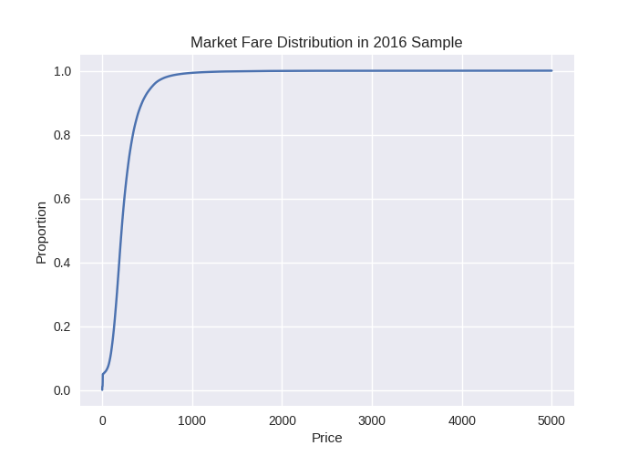
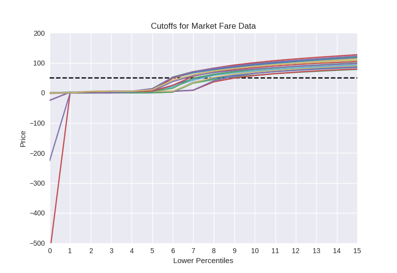
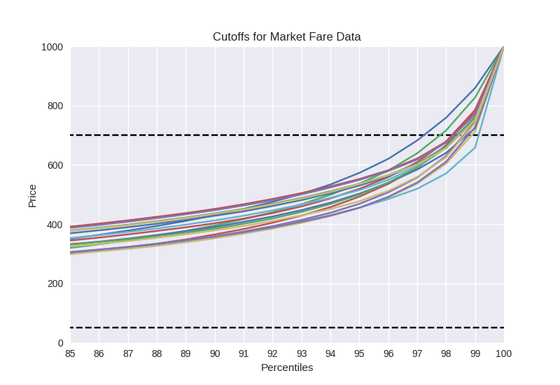

# Procedures for downloading and cleaning data set.

The data tables provided by the <a href="https://www.bts.dot.gov/">Bureau of Transportation Statistics</a> (BTS) are rather complete, but we did run into a few issues when curating our data set. Instructions for downloading the data have been included in the <code>readme</code> for this repository, but we also have a brief reminder here. We will also describe the procedure for handling problematic files and processing the CSV files to reduce overall size.

<b>A. File sources for data set.</b>

We are mostly interested in the <a href = 'https://www.transtats.bts.gov/DatabaseInfo.asp?DB_ID=125'>On-Time Performance</a> tables from the BTS website, and also the <a href="https://www.transtats.bts.gov/tables.asp?db_id=125&DB_Name=Airline%20Origin%20and%20Destination%20Survey%20%28DB1B%29#">Market</a> data, which describes the fare pricing for different destinations. 

For both data sets, we focus on the years 2000-2016. This project was created in 2017, when the data were still incomplete for that year. Throughout the years, a number of airlines have been merged into large companies or closed. We will focus our analysis on airlines that were active in 2016, and their associated companies, as indicated by the airline <a href="http://www.airlines.org/dataset/u-s-airline-mergers-and-acquisitions/">mergers and acquisitions</a> provided by <a href="http://airlines.org">Airlines for America</a>.

The On-Time Performance data is updated daily, and details flight origin, destination, flight duration delays, and so forth. On the other hand, the Market tables are created quarterly, and take a 10% sample of the consumer market, and includes information such as the origin airport, desintations, number of legs in an itinerary, duration, distance and cost.

Source codes for downloading these files are included in this repository.
<ul>
  <li><code>00_download_ontime_data.py</code> (On-Time Performance data)</li>
  <li><code>00_download_market_data.py</code> (Market Data)</li>
</ul>

It is recommended that these files be downloaded and uncompressed in their respective directories.

Airline mergers were also evaluated and saved as dictionaries that will come in handy later. Please check the <code>00_airline_mergers.py</code> file for this information.

<b>B. Files with binary characters.</b>

A number of CSV files from the early 2000s were problematic. Attempting to read these in Python will throw an error, so we need to clean them before hand using a c-shell file or similar. An example is shown here:


```python
#!usr/bin/tcsh -f

# Remove binary characters

tr -cd '\11\12\15\40-\176' < On_Time_On_Time_Performance_2001_1.csv > clean-file
mv On_Time_On_Time_Performance_2001_1.csv On_Time_On_Time_Performance_2001_1.bak
mv clean-file On_Time_On_Time_Performance_2001_1.csv
```

Replace the CSV file name as needed for what needs to be cleaned. This will save the processed file to <code>clean-file</code>, then replace it with the original file name. Repeat as often as needed or create a larger file that includes all CSV documents that need this correction.

<b>C. Minimizing file sizes</b>

Not all columns are needed for our analysis, so we should only keep the pieces that would be useful to us to save space.
The columns retained are descriptive enough to distinguish one flight from another, and repetitive information is reduced. This protocol can befound in the <code>00_process_data.py</code> file.

<b>D. Evaluating outliers.</b>

There are outliers in the Market Fare data, and we evaluated reasonable cutoffs based on the distribution of ticket prices for a given year. The cumulative distribution functions were not the most informative, as seen in the example here for 2016.

<center>

</center>

We took a closer look at the lower percentiles for all fare data from 2000-2016 to find our lower-bound cutoff, and repeated the procedure for the higher percentiles to determine and upper-bound. This information is provided in the below line plots, where each colored line represents a different year in the data. Note that most flights are single-leg here, so we also considered how reasonable the pricing was for one-way flights. 

<center>

<br>

</center>

We decided to use a \$50 lower bound and \$70 upper bound (shown in the black dashed lines.) This analysis and re-processing of data files can be found in <code>01_mktfare_cutoffs.py</code>, which also includes how these figures were made.

Outliers are also found in the On-Time Performance data, such as delays that have several hundred negative minutes, where negative indicates a flight left early. These are uncommon or possible errors, we think. However, in our analysis, we tend to count the whether a flight left on time or was delayed (positive value), so it would not affect our calculations later. Although the On-Time Performance tables were not further modified, it is important to keep this in mind later.

<b>E. Missing values.</b>

When a flight leaves on time, there will be missing values for most of the columns, and most flights tend to leave on time. Consequently, even though missng values are very prominent in the On-Time Performance dta, we did not fill in the zeros for extended storage. However, fo calculations later, we fill in the values for these on-time flights with zeros as needed. 

Why do this? We have more flexibility in what is considered an average flight delay, for instance. If most flights are counted as 0, then the average delay time would be reduced, rewarding a company for good performance. By leaving missing values as is, we can also get a better calculation for how long delays usually take, if they were to happen.
