# Patterns in Flight Routes and Overall Performance

### Where are people going and how soon will they get there?

The market for air travel has grown over the last several years, offering customers with a convenient option for traveling long and short distances to their destinations. Here, we will examine the scope of flight operations in the U.S. airline industry by analyzing the On-Time Performance data provided by the Bureau of Transportation Statistics (BTS) for domestic flights.

These data are from 2000 until 2016, and contains the daily records for all domestic flights by U.S. carriers. This project began before the full set of 2017 data was collected, so it has not been included in this version of the analysis. These on-time performance data will be used later for comparison with Market data, also provided by the BTS, which are quarterly reports on the ticket prices for specific routes, randomly drawn from all available customer data. The Market data collected represents roughly 10% of the entire customer base.

These data have been processed for outliers and other anomalies, as described in an earlier <a href="https://github.com/aloretta/flight-project/blob/master/00_data_wrangling.md">report</a>. We were interested in understanding the network created by different flight routes, how these flights are typically scheduled, the general reliability of departure times, and how well airline companies are able to meet these demands. Later, we'd like to understand which factors influence ticket pricing the most, and identify possible signals for estimating pricing.

The results of our analysis here is organized into four sections:
<ul>
<li><a href='#sectionA'>Aiport Routes</a>: how extensive are domestic flights and what are the routes between different airports?</li>
<li><a href='#sectionB'>Flight Schedules</a>: what patterns can we find in scheduled flights throughout the year?</li>
<li><a href='#sectionC'>Flight Delays</a>: how often are flights delayed and when do they tend to happen?</li>
<li><a href='#sectionD'>Airline Performance</a>: how similar are different companies in flight capacity and how does this affect performance?</li>
</ul>

Relevant source codes: <code>01_flight_trends.py</code>, <code>01_compare_airports.py</code>, <code>01_network_flights.py</code> and <code>01_network_flights.py</code>

## A. How extensive are domestic flights and what are the routes between different airports?

### 1. About 20% of all U.S. airports have an important role in flight itineraries.

The data for this 16 year period represents 1338 different routes between 135 different U.S. Airports. The popularity of these routes vary, of course, with some flights being far more frequent than others. To understand the scope of how these airports and routes are related, we looked at the networks created by these flights:
 
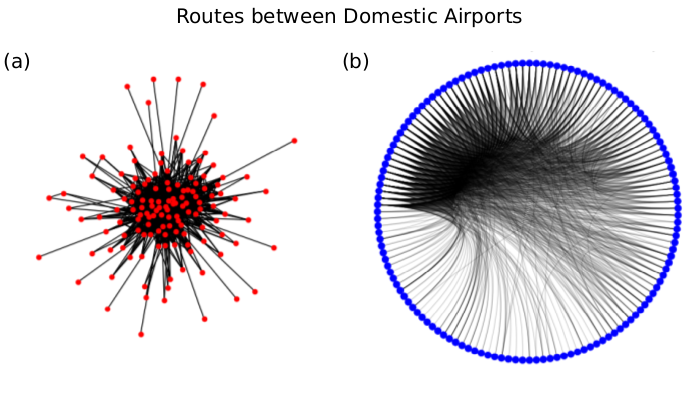
 

There are 135 nodes representing the airports, and edges are drawn when a known route exists between them. The first representation (a) is drawn in the 'hairball' style, where nodes with fewer connections (smaller degree) tend to be further out, while the second (b) is the same network with the nodes organized according to the normalized betweenness centrality values. Betweenness centrality measures how often a node is included among the shortest paths available in a network, then normalized by the total number of shortest paths in the network. 

Larger values for betweenness centrality for a node typically suggest that it may be an important hub for all other nodes in the graph. From these network representations, we find that about 20% of all airports are well connected to other destinations. The distribution of betweenness centrality values for all U.S. airports is shown in the figure below, and airports with a normalized value that exceeds 0.05 are highlighted. 

 
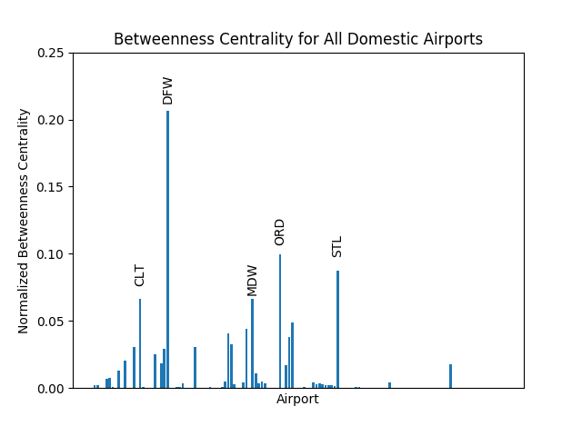
 

These highlighted airports are consistent with some of the major hubs in the airline industry: Dallas/Fort Worth International Airport (DFW), O'Hare International Airport (ORD), Chicago Midway International Airport (MDW), St. Louis Lambert International Airport (STL) and Charlotte Douglas International Airport (CLT).

What may be surprising, though, is that other international airports such as Los Angeles International Airport (LAX), San Francisco International Airport (SFO) and John F. Kennedy International Airport (JFK) are not seen in this analysis.
These airports are also very busy and known for handling large numbers of travelers every day. However, the data we have focused only on domestic flights, thus the absence of LAX, SFO, JFK and others are most likely an indication that these airports have a comparatively greater proportion of international flights than the airports listed in the above figure.
 
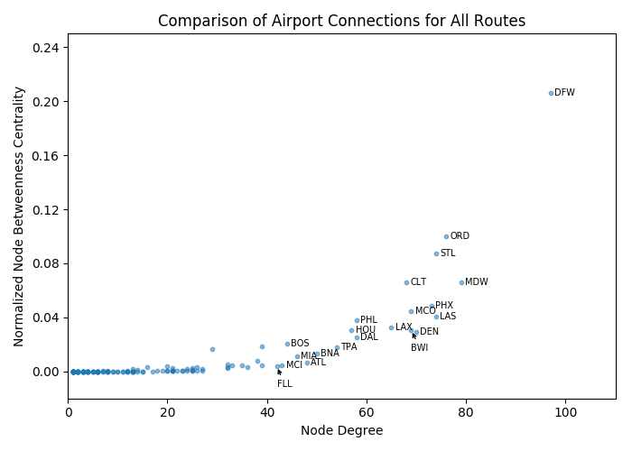
 
While betweenness centrality helps us compare the number of paths that include a specific airport, the degree for each node is also an indication of how well it is connected to other airports. The degree for any node in a graph is the number of edges that reaches it, and in the case of flight routes, we are looking at the number of routes that enter/exit an airport. 

It's important to note that betweenness centrality and node degree are not necessarily correlated for many networks. The comparison between these two features are shown in the above figure. We see that there are several airports that are involved in approximately 30 unique flight routes, but their betweenness centrality is nearly zero. This means that these airports may be common destinations, but probably are not airports for connecting flights. 

The same correlation plot also shows a handful of airports that have an exponential/curved relationship between the two properties measured. This suggests that these airports are not only very common flight destinations, but they are also major hubs for connections as well, at least for domestic flights. We have highlighted these airports with their three-letter code in text.

### 2. Outbound and inbound air traffic tends to be similar for most airports.

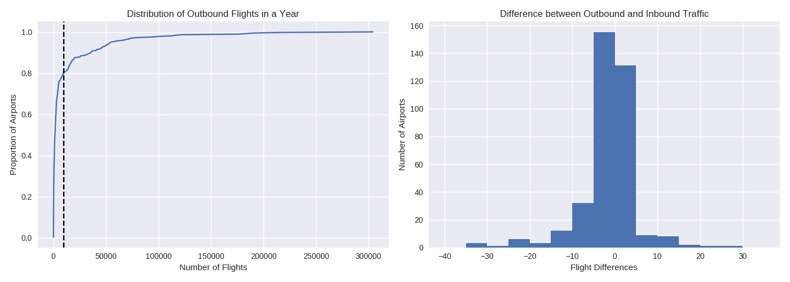

We looked further to understand the air traffic experienced at these airports. In the left panel for the figure above, we have the cumulative distribution function for the average number of outbound flights for each airport per year during the 16-year period. The vertical dashed line represents 100,000 flights per year. We found that about 20% of all airports have at least 10,000 flights per year. About 60% of all U.S. airports have fewer than 5,000 flights per year.

When we evaluated the inbound and outbound traffic for these airports, we found that most airports have nearly the same number of arriving and departing flights, as seen in the right panel for the figure above. There are some airports, however, that have a greater disparity in the number of flights entering or leaving. These are likely destinations that serve well as connecting airports, but are not necessarily locations where airlines tend to be based. A few discrepancies can also be weather related, resulting in flight cancellations, so that the net volume of flights becomes unbalanced at certain airports.

### 3. The most highly frequented routes are not necessarily the most extensive ones.

We wanted to evaluate how popular different routes may be in the network by counting the number of flights between any two destinations throughout the 16-year period. We treated all flights as equal, so that shorter connecting flights, for example, have the same signficance as a non-stop flight. The directionality of all flights was ignored here, since the number of inbound and outbound flight tends to be similar for most airports. This means that a flight from airport A to B is counted the same as a flight from airport B to A. 

Although these quantities can be easily represented as weighted edges on a direct graph, it would be too difficult to read. Alternatively, we looked at how these values are distributed, and found a large discrepancy in the frequency of flights for certain routes.
 
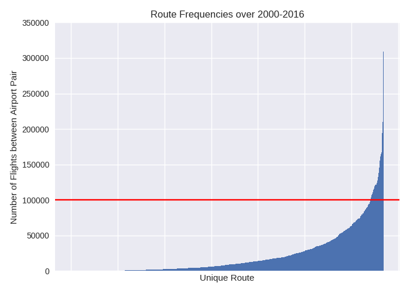
 

The 1338 unique routes were sorted along the x-axis according to the cumulative total over the 16-year period. The values show a curved distribution, which tells us that popular flight routes are available at a much greater frequency than the less traveled ones. Furthermore, many routes are actually very uncommon, with fewer than 50,000 flights over all 16 years. This averages to about 3,125 flights per year, or fewer than 9 flights per day for these routes. Most likely these are for smaller airports serving areas that are more suburban or rural than the airports found near major cities.

We took a closer look at routes that have over 100,000 flights over the 16 year period (horizontal red line) to see which destinations are involved. The bar graph below represents the data for this group, and we find that many of the airports for these routes are the hubs we previously highlighted. 
 
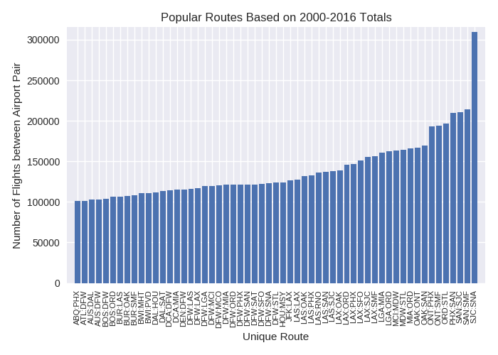
 
These flights are often between large cities that do not necessarily have high traffic for domestic flights or are flown over shorter distances, especially for airports in California. For example, the most traveled route is between San Jose International Airport (SJC) in San Jose, CA, and John Wayne Airport (SNA) in Orange County, CA. Providing frequent service between nearby airports is beneficial for companies, since the amount of resources (such as time and fuel) needed are reduced compared to flights that span different time zones. Shorter flights also provide a convenient option to customers, who may prefer air travel over a train ride or road trip, either of which may take several hours longer.

<a href='#intro'>Back to top.</a>

## B. What patterns can we find in scheduled flights throughout the year?
### 1. Volume of available flights often reflect common vacation schedules

We organized each flight according to departure date, focusing on the month of the year and day of the week, in order to find possible motifs in the itineraries. These data were prepared for the 2D histogram below, and some noticeable patterns can be found.

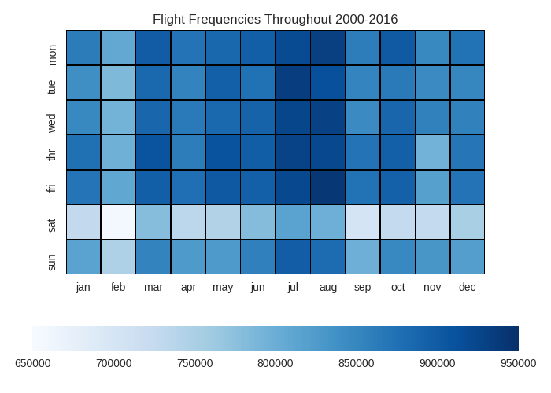

The boxes in the 2D histogram are colored relative to each other, so a darker shade of blue indicates a greater number of flights, while lighter colors represent smaller values. Even for low values, though, the cumulative total over the 16-year period exceeds 600,000 flights for every combination of month and day.

For most Americans, a typically work week spans Monday through Friday. This schedule is reflected in the frequency of flights offered by airlines throughout the week: most flights tend to fall on Monday, Thursday and Friday, while fewer flights are on Tuesday and Saturday.

Flights at the beginning of the work week may be more common, so that travelers may return to work shortly after a trip or on the same day as their flight. Similarly, an increase in the number of flight towards the end of the work week provides more options to those hoping to spend the full weekend at their chosen destination. In both situations, travelers may end up taking fewer days off from work to optimize their time traveling.

Relatedly, Tuesday may be a less popular time of the week to fly, so that fewer vacation days are needed for a trip, and flying out on a Saturday cuts into the weekend, which may be an unpopular decision for some customers.

Although Thursday and Friday tend to have a greater number of flights for most months during the year, November seems to be the exception. This is likely due to the Thanksgiving holiday, which consistently falls on Thursday. Travelers may be discouraged from traveling on Thanksgiving Day, in case of delays or other itinerary changes that may negatively impact their holiday plans.

### 2. There are more flights during summer months, perhaps due to weather, holidays and vacation plans

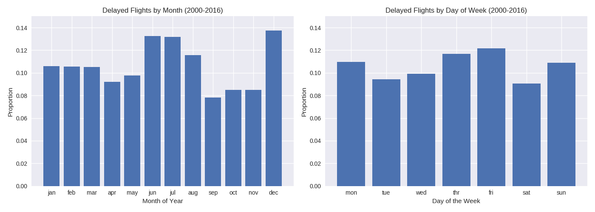

In the above bar graphs, we computed the total number of flights for each month as a proportion over the total number of flights recorded in the On-Time Performance data. Similar calculations were performed for the days of the week. In both cases, this analysis allows us to compare the relative proportion within each group (either for all months or for all days of the week), and see where major increases or decreases in the total number of flights are found.

The greatest number of flights are during the peak summer months: July and August. Summer usually has better weather throughout the United States, which may encourage people to travel and explore more beyond their local region. The nicer summertime weather may also be easier to pack for, and a greater number of travel destinations may be desirable to visit during this season. Furthermore, better weather can also mean fewer flight delays related to surrounding environmental factors. School also tends to be out of session during the summer, so many families may choose to take advantage of this opportunity to travel together.

February has the fewest number of flights, according to the 2D histogram we previously saw, because there are the fewest days in that month. These measurements are subtotals, after all, rather than relative proportions. If an additional two or three days were added to February, the total number of flights should be similar to other winter months, and we see this after the normalization to proportions in the above bar graph.

Overall, there seems to be a strong correlation between the frequency of flights and the likelihood that customers may choose to take them based on their personal schedules.

<a href='#intro'>Back to top.</a>

### C. How often are flights delayed and when do they tend to happen?
### 1. Flight-delay frequency varies throughout the year, independent of the total number of flights.

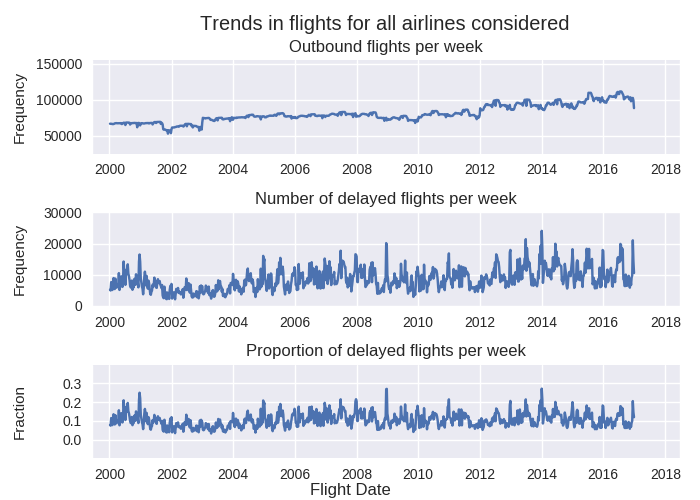

The time series data in the above figure features weekly values for (from top to bottom): the total number of outbound flights, the number of delayed flights, and the ratio of delayed flights to total flights. A flight that departed 30 minutes later than scheduled was considered a delayed flight.

There is a direct correlation in the number of outbound flights each week over the 16-year period, indicating that the market continues to grow and, presumably, so has consumer demand (top sub-figure.) A very noticeable exception to this trend, however, is the period from late 2001 up to the end of 2002, which reflects the shift in the airline industry after September 11th in 2001. The nature and severity of the terrorist attack prompted reductions in the number of flights, in addition to modifications for security policies that directly affected air travel. Consumer demand likely dropped as well in response to these changes. There are also periodic drops in the total number of flights throughout a year, which mostly reflects the less popular months for travel which we found in our earlier analysis.

### 2. Most flight delays appear to be scale-invariant.

Although the total number of flights have increased over time, the number of delayed flights has not evolved in a predictable way. We find that there are many local maxima every year in the graph, and some of these peaks have similar values. The maximum number of delays found throughout 2008 and 2010, for instance, is just as high as those in 2000 until 2002. Between late 2015 to the end of 2016, we also find small regions in the middle time-series figure that shows consistency in the number of delays. These data tell us that there were several weeks in which the number of delays did not necessarily improve, such as due to periods of poor weather. On the other hand, there are also some weeks in which most operations were functioning as expected, so the number of delays was more stable.

In the time series for the number of delayed flights (middle sub-figure), we find that there are greater increases between consecutive weeks for the later part of the 16-year period (a difference of about 10,000 flight delays from one week to another), compared to the first few years of this data set (approximately 5,000 flight delays between two time points.) 

When we consider the proportion of flights delayed (bottom sub-figure), the computed values are rather consistent across all 16 years. These ratios reveal that very often at least 10% of all flights will experience a delay for most weeks of the year. Between 2001 until the end of 2004, we find that this proportion never exceeds 20% of all flights. Outside of this time interval, there are occasional weeks that exceed this upper bound.

The greater on-time efficiency between 2001 and 2003 may be due to the relatively lighter air traffic than in the years before or after this period. An increase in the number of flight operations can cause more congestion at airports where one delayed flight will affect a successive one, for instance. Weather-related issues can also have a role in the sudden changes between weeks in the proportions measured for these data. 

The local maxima are somewhat periodic, and we will see whether certain times of the year are more prone to flight delays than others. Winter travel itineraries may be more vulernable to this, but it will also depend on geographic region.

<a href='#intro'>Back to top.</a>

### D. How similar are different companies in flight capacity and how does this affect performance?
### 1. On-time efficiency of flights slightly hindered by company growth.

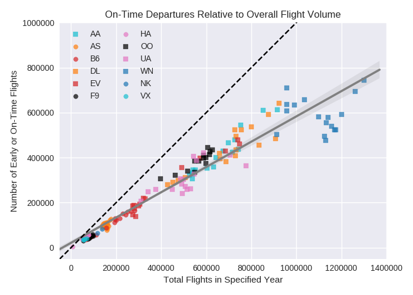

Many airline companies have undergone mergers and acquisitions througohut the 16-year period, directly increasing their capacity to handle more flights. Here, we evaluate whether an increase in the size of their operations affects the overall flight departure times.

The linear regression analysis above compares the number of early and on-time flights with the total number of flights provided by a company for each year it has been in business between 2000 and 2016. The sets of data points for each company are represented by different shapes and colors to distinguish one group from another. The regression line is shown as a solid dark-gray line, and the 1-to-1 fit (where <i>y</i> = <i>x</i>) is shown as a dashed black line. The lightly shaded gray regions around the regression line is the 95% confidence interval for the linear fit.

For reference, the airlines are: American Airlines (AA), Alaska Airlines (AS), 
JetBlue Airways (B6), Delta Airlines (DL), ExpressJet Airlines (EV), Frontier Airlines (F9), 
Hawaiian Airlines (HA), SkyWest Airlines (OO), United Airlines (UA), Southwest Airlines (WN), 
Spirit Airlines (NK), Virgin America (VX).

An efficient company would be able to have a high proportion of early and on-time flights, and ideally fall along the dashed black line. Instead, we find that all companies fall short to some extent, but there tends to be similar performance between companies, as we find the majority of these data points fall along the regression line. 

Southwest Airlines (WN) as a whole performs rather differently compared to the other airline carriers. The company has the greatest number of flights, but also the greatest number of delays. According to this analysis, when Southwest Airlines was a smaller company, the proportion of early and on-time flights was also greater. While having more flights to manage may play a role in this shift, factors including changes in the number of airports served or the timing of flights for certain routes may contribute to departure problems as well. 

### 2. Most delays are resolved within 30 minutes, but longer delays are possible with certain airlines

Earlier analysis has revealed that companies can have varying rates of on-time performance. We compared the total delays experienced on flights operated by different airlines by organizing departure times into 5 different categories. Early and on-time flights departed by the scheduled departure time, and the remaining categories are half-hour delays, with delays exceeding 2 hours falling into the last category. The proportion of flights that fit into each of these definitions are found in the following horizontal stacked bar graph.

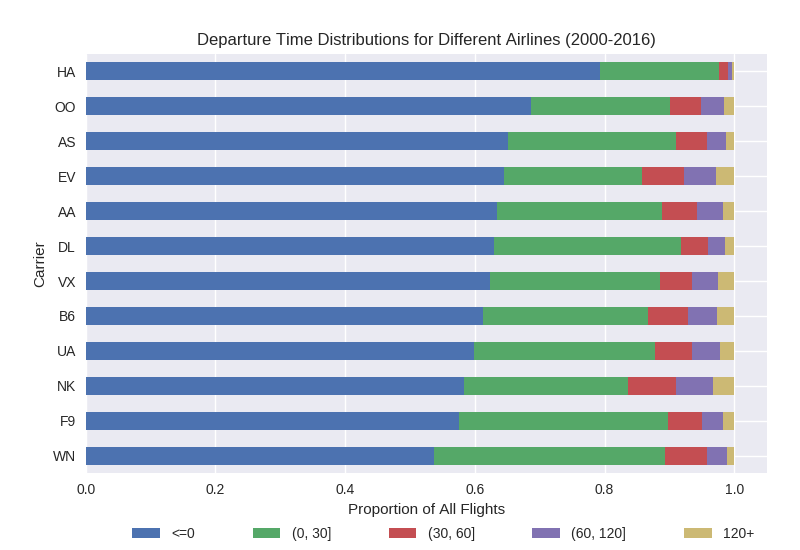

Based on this analysis, Hawaiian Airlines (HA) has the fewest delays overall, and for the delays that their flights do experience, they tend to be shorter than other companies. On the other hand, we see that Frontier Airlines (F9) and Southwest Airlines (WN) has the greatest proportion of delays during this time frame. Spirit Airlines (NK) and ExpressJet Airlines (EV) have a more noticeable proportion of flights with delays that exceed 2 hours.

Part of Hawaiian Airlines success may be due to the smaller number of domestic airport destinations, compared to Southwest Airlines. Hawaiian Airlines has service at a number of airports in Hawaii and California, which are areas that tend to have warmer climates and perhaps more agreeable flight conditions throughout the year. Frontier has a similar number of flights, but the destinations tend to be spread out through the continental U.S. Southwest Airlines has the greatest number of total flights out of these three airlines, with destinations that vary significantly in geography as well.

These findings suggest that location and related environmental factors (such as weather, but also congestion that can happen in local air traffic) contribute to the puntuality of a departing flight. Companies that tend to have a greater number of flights overall do not necessarily have a worse overall performance compared to smaller companies, if the destination airports are geographically diverse.

<a href='#intro'>Back to top.</a>

### Summary and Conclusions

The network of U.S. airports spans 135 airports and over 1300 unique routes, and the results of our analysis reflect that airline companies have grown but continue to adapt to customer needs. Flights tend to be more frequent on days that may be more convenient for a working adult to take time off, for example, and the scale of their operations have expanded to different destinations. Furthermore, offering a greater number of flights per year to customers does not have a strong effect on whether a flight may be delayed.

Delays can be rather hard to predict, but some airline companies like Southwest Airlines and Frontier Airlines may be more prone to them. This partly depends on which routes they tend to frequent, however. Airline customer service may have some role that affect departure times, such as in their efficiency to check-in and board passengers, but these factors are in these data tables. It is more likely that local weather at an airport or the amount of air traffic per day are causing these delays. 

We will be examining the departure dates more closely in our next analysis to see if there are common times of the year when flight delays are more likely to happen. We will also compare the delays at airports, and see how much they contribute to the on-time performance of different air carriers.
